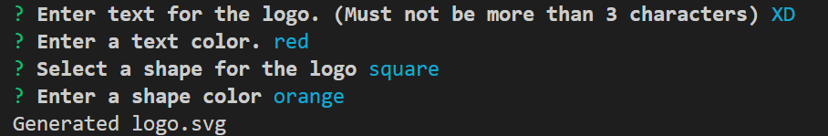
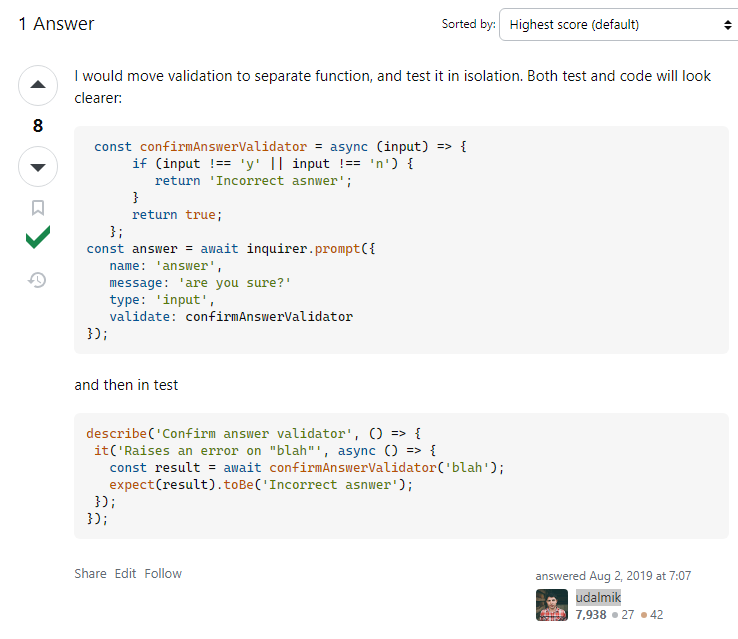

# 10-SVG-Logo-Maker

        
## Description
            
This project is an SVG logo creation application using the Node.JS command line interface ['inquirer'](https://www.npmjs.com/package/inquirer) and JavaScript testing framework ['jest'](https://jestjs.io/). It serves as the week 10 challenge for The University of Sydney's Coding Bootcamp.

I built this application as a way to easily create an SVG logo based on user input for shape type, shape colour, text within the shape and text colour. This application removes any barriers required for understanding how to create an SVG file and therefore makes it extremely easy to make one from scratch.

By completing this project, I gained a solid understanding of how to utilise Javascript classes and import them throughout other files in the project. I also feel more comfortable implementing tests and better understand their usefulness when used correctly. 

### Video showing how the application works:

To understand how the application creates an SVG file based on user inputs and run its tests, please watch [a video demonstration here](https://drive.google.com/file/d/17QnuLQ_bRo-0UGGBxbTJB2MM4aULQaBa/view). 

### Screenshot of application showing user input prompts:

The screenshot below shows all prompts made to the user via the inquirer command line interface:

### Screenshot of SVG logo created

Below is an example of an SVG logo created using this application:

### More examples of created logo.SVG files:

If you would like to see more examples of SVG logos generated using this application, please visit the 'examples' folder in this repository. [Link to the examples folder within this repository.](./examples/)
            
## Table of Contents
            
- [Installation](#installation)
- [Usage](#usage)
- [License](#license)
- [Contributing](#contributing)
- [Tests](#tests)
- [Questions](#questions)
            
## Installation

To install this application, you'll need to firstly clone the repository to your local machine. [Refer to this guide from GitHub if you need help.](https://docs.github.com/en/repositories/creating-and-managing-repositories/cloning-a-repository/)

Once cloned, you will need to navigate to the project's folder in your terminal and run the command 'npm i' to install the necessary dependencies. 
            
## Usage

Once the installation has completed and you've navigated to the project's folder in your terminal, enter the command 'node index.js' to run the application. 

Once all prompts are answered, a new logo.SVG file should be created in your project folder. 
            
## License
            
MIT License

Copyright (c) 2024 isaacfallon
            
Permission is hereby granted, free of charge, to any person obtaining a copy
of this software and associated documentation files (the "Software"), to deal
in the Software without restriction, including without limitation the rights
to use, copy, modify, merge, publish, distribute, sublicense, and/or sell
copies of the Software, and to permit persons to whom the Software is
furnished to do so, subject to the following conditions:
            
The above copyright notice and this permission notice shall be included in all
copies or substantial portions of the Software.
            
THE SOFTWARE IS PROVIDED "AS IS", WITHOUT WARRANTY OF ANY KIND, EXPRESS OR
IMPLIED, INCLUDING BUT NOT LIMITED TO THE WARRANTIES OF MERCHANTABILITY,
FITNESS FOR A PARTICULAR PURPOSE AND NONINFRINGEMENT. IN NO EVENT SHALL THE
AUTHORS OR COPYRIGHT HOLDERS BE LIABLE FOR ANY CLAIM, DAMAGES OR OTHER
LIABILITY, WHETHER IN AN ACTION OF CONTRACT, TORT OR OTHERWISE, ARISING FROM,
OUT OF OR IN CONNECTION WITH THE SOFTWARE OR THE USE OR OTHER DEALINGS IN THE
SOFTWARE.
            
## Contributing

My codebase utilises code from one external source.

To ensure my prompt inquirer could validate correctly, I referenced the [following StackOverflow question](https://stackoverflow.com/questions/57321266/how-to-test-inquirer-validation) with the answer from user [udalmik](https://stackoverflow.com/users/1584167/udalmik).

Full link: https://stackoverflow.com/questions/57321266/how-to-test-inquirer-validation

            
## Tests

There are two testing suites that contain five seperate tests within.

To run these tests, navigate to the project's folder in your terminal. Once you've installed all necessary dependencies by entering: 'npm i', you can run the tests by entering: 'npm run test'.

The five tests are the following:
- Shape rendering testing suite (located in file 'shapes.test.js')

    1. Circle test - The circle shape as the colour 'blue' should render to screen

    2. Square test - The square shape as the colour 'blue' should render to screen

    3. Triangle test - The triangle shape as the colour 'blue' should render to screen

- User input testing suite (located in file 'svg.test.js')
    
    4. Testing user input for shape type
    
    5. TESTING EVERYTHING: Testing every user input with a blue circle as example case

            
## Questions
            
If you have any questions, please reach out at either of the following:
            
### GitHub profile:
- https://github.com/isaacfallon

### Email:
- isaac.fallon@gmail.com